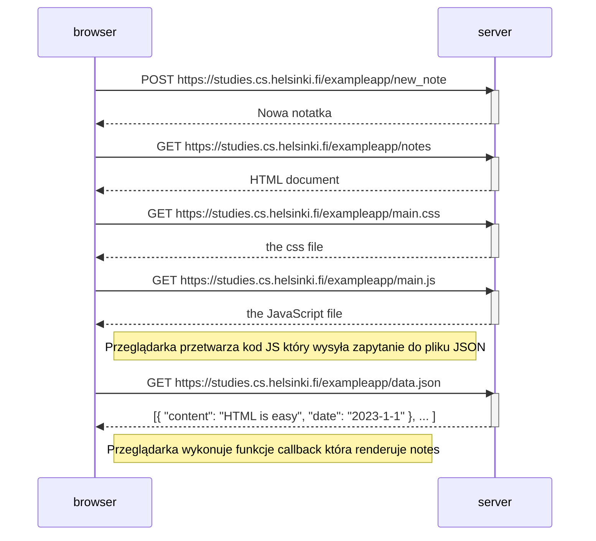

```mermaid
	sequenceDiagram
	participant browser
	participant server

	browser->>server: POST https://studies.cs.helsinki.fi/exampleapp/new_note
	activate server
	server-->>browser: Nowa notatka
	deactivate server


	browser->>server: GET https://studies.cs.helsinki.fi/exampleapp/notes
	activate server
	server-->>browser: HTML document
	deactivate server

	browser->>server: GET https://studies.cs.helsinki.fi/exampleapp/main.css
	activate server
	server-->>browser: the css file
	deactivate server

	browser->>server: GET https://studies.cs.helsinki.fi/exampleapp/main.js
	activate server
	server-->>browser: the JavaScript file
	deactivate server

	Note right of browser: Przeglądarka przetwarza kod JS który wysyła zapytanie do pliku JSON

	browser->>server: GET https://studies.cs.helsinki.fi/exampleapp/data.json
	activate server
	server-->>browser: [{ "content": "HTML is easy", "date": "2023-1-1" }, ... ]
	deactivate server

	Note right of browser: Przeglądarka wykonuje funkcje callback która renderuje notes

```